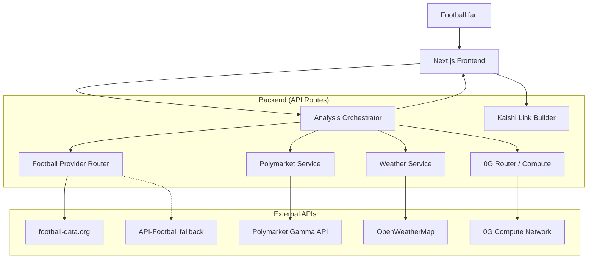
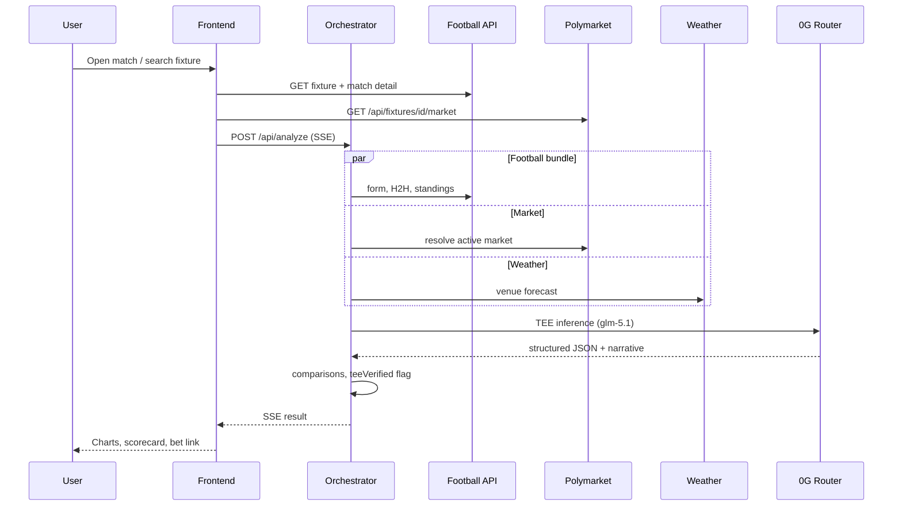

# ai.ball — Architecture

**AI football analyst** for fans who want data-backed, TEE-verified match breakdowns before betting on [Polymarket](https://polymarket.com) or [Kalshi](https://kalshi.com). ai.ball is not a sportsbook and not affiliated with either market — it attaches direct market links when a fixture is found. **Analysis only — not betting or financial advice.**

**Live:** [https://aiballanalysis.vercel.app](https://aiballanalysis.vercel.app) · **Repo:** [github.com/mandatedisrael/ai.ball](https://github.com/mandatedisrael/ai.ball)

---

## 1. Overview

### 1.1 Purpose

Football lovers pick a match. The system:

1. Resolves the fixture from search or league browse
2. Fetches real football statistics from external APIs (never hallucinated)
3. Loads live match detail when available (score, scorers, lineups, stats)
4. Runs inference via **0G Router / Compute** inside a TEE-attested environment
5. Optionally fetches **Polymarket** prices for model-vs-market comparison
6. Surfaces a **bet CTA** — Polymarket when a market exists, otherwise a Kalshi deep link
7. Renders analysis: charts, narrative, trading insight, and Ask Analyst follow-ups

### 1.2 Design Principles

| Principle | Implementation |
|-----------|----------------|
| Football first | Stats and form drive the model; markets are context and comparison |
| TEE-verified AI | Analysis marked TEE verified; inference via 0G with attestable execution |
| Data before inference | All facts injected into the LLM prompt as structured JSON |
| Graceful degradation | Missing Polymarket market → Kalshi fallback link; thin liquidity → warn, never hard-fail |
| Research, not advice | Probabilities, deltas, confidence — plus clear disclaimer |

---

## 2. System Context



---

## 3. Data Sources

### 3.1 Primary: football-data.org

Configured via `FOOTBALL_DATA_API_KEY`. Free tier: **10 requests/minute**.

| Endpoint | Use |
|----------|-----|
| `/competitions/{code}/matches` | Fixtures by league and date range |
| `/matches?status=LIVE` | Live fixtures |
| `/matches/{id}` | Full match detail — score, goals, lineups, stats, cards, subs |
| `/matches/{id}/head2head` | H2H history |
| `/competitions/{code}/standings` | League table (not cups e.g. World Cup) |
| `/teams/{id}/matches` | Recent form |

Provider router: `src/services/football/provider.ts` — prefers football-data when the key is set.

### 3.2 Fallback: API-Football (api-sports.io)

Used when `FOOTBALL_DATA_API_KEY` is absent. Adds **injuries** and richer live stats. Free tier ~100 req/day.

### 3.3 Market context: Polymarket Gamma API

- Base: `https://gamma-api.polymarket.com` (env `POLYMARKET_GAMMA_BASE_URL`)
- Search by team names; resolve match-winner (3-way) markets
- Read-only; comparison and deep links only — not fed as primary football signal

### 3.4 Betting links: Kalshi (fallback)

No Kalshi API yet. `src/lib/betting-links.ts` builds URLs:

- **Polymarket** when `market.found && market.url`
- **Kalshi** otherwise — World Cup market slug when possible, else category or search URL

UI: persistent bet CTA in match header (desktop pill + mobile bottom bar).

### 3.5 Supplementary

| Source | Use |
|--------|-----|
| OpenWeatherMap | Stadium weather by venue geocode (optional) |

### 3.6 User data

Browser `localStorage` only — saved analyses and session fixture stash. No server database.

---

## 4. Analysis Pipeline



### 4.1 Orchestrator steps (`src/services/orchestrator/analyze.ts`)

1. Resolve fixture (API or session stash)
2. `buildMatchDataBundle` — parallel football fetches
3. `resolvePolymarketMarket` — fuzzy team + league match
4. Optional weather for venue
5. `runZerogAnalysis` — analyst prompt + JSON schema
6. `buildComparisons` — model vs Polymarket implied probs
7. Stream progress: fixture → football → polymarket → weather → inference → complete

### 4.2 LLM output schema

```json
{
  "probabilities": { "home": 0.58, "draw": 0.25, "away": 0.17 },
  "confidence": "medium",
  "narrative": "...",
  "key_factors": [{ "factor": "...", "impact": "positive", "weight": 0.25, "detail": "..." }],
  "risks": ["..."],
  "trading_insight": "..."
}
```

Probabilities normalized to sum ~1.0. Draw shown explicitly in UI; if home + away &lt; 100%, remainder is displayed as draw.

### 4.3 0G integration

- **Router:** `ZEROG_ROUTER_API_KEY`, model `glm-5.1` (`ZEROG_ROUTER_MODEL`)
- Lazy SDK load for serverless compatibility
- Responses flagged `teeVerified: true` when inference succeeds

---

## 5. Frontend Architecture

### 5.1 Stack

- **Next.js 16** (App Router)
- **React 19**, **TypeScript**, **Tailwind CSS v4**
- **Recharts** for probability, form, factor, H2H charts
- **SSE** for analysis streaming

### 5.2 Match page layout

```
┌────────────────────────────────────────────────────────────┐
│ Header — ai.ball, theme toggle                             │
├────────────────────────────────────────────────────────────┤
│ Match card — score, scorers, per-team win %, draw %        │
│              bet CTA (Polymarket / Kalshi)                 │
├────────────────────────────────────────────────────────────┤
│ Live match centre — stats, cards, subs (when available)    │
│ Lineups — formations, starting XI, bench                   │
├────────────────────────────────────────────────────────────┤
│ Analysis — TEE callout → chart grid (prob + form + factors)│
│            volatility / confidence → narrative → insight     │
│ Ask Analyst — follow-up chat                               │
└────────────────────────────────────────────────────────────┘
```

### 5.3 Key components

| Component | Responsibility |
|-----------|----------------|
| `MatchScorecard` | Score, scorers, win/draw % under team names |
| `BetMarketRail` | Polymarket or Kalshi CTA |
| `MatchLivePanel` | Live stats, cards, substitutions |
| `MatchLineups` | Confirmed lineups from match detail API |
| `AnalysisChartsGrid` | Compact side-by-side chart row |
| `AnalysisResultsPanel` | TEE badge, narrative, trading insight |
| `AskAnalyst` | Grounded follow-up Q&A |

---

## 6. API Routes

| Route | Method | Description |
|-------|--------|-------------|
| `/api/fixtures/search` | GET | Search fixtures by team/league |
| `/api/fixtures/[id]` | GET | Fixture summary |
| `/api/fixtures/[id]/detail` | GET | Live detail, lineups, goals (polls when live) |
| `/api/fixtures/[id]/market` | GET | Polymarket resolution |
| `/api/analyze` | POST | Full pipeline; SSE stream |
| `/api/chat` | POST | Ask Analyst follow-ups |
| `/api/health` | GET | Provider status, rate-limit headers |
| `/api/leagues` | GET | Supported competitions |

---

## 7. Caching & Rate Limits

| Data | TTL | Notes |
|------|-----|-------|
| Fixture list | 5 min | football-data default revalidate |
| Match detail (live) | no-store | Client polls every 30s |
| Match detail (finished) | 60s | CDN stale-while-revalidate |
| Polymarket | no-store on analyze | Cached cautiously on market route |
| 0G inference | — | No cache |

football-data.org: track `X-Requests-Available-Minute` in `/api/health`.

---

## 8. Security & Configuration

- API keys server-side only — see `.env.example`
- Never commit `.env.local`
- Disclaimer on analysis and market links

**Required for production:**

- `FOOTBALL_DATA_API_KEY`
- `ZEROG_ROUTER_API_KEY`
- `ZEROG_ROUTER_MODEL=glm-5.1`

---

## 9. Deployment

| Target | Role |
|--------|------|
| Vercel | Next.js frontend + API routes |
| GitHub | `mandatedisrael/ai.ball` |

---

## 10. Project structure

```
ai.ball/
├── architecture.md
├── README.md
├── src/
│   ├── app/                    # App Router pages + API
│   ├── components/             # UI including charts, scorecard, bet rail
│   ├── services/
│   │   ├── football-data/      # Primary football client
│   │   ├── football/           # API-Football fallback + provider router
│   │   ├── polymarket/
│   │   ├── orchestrator/
│   │   └── zerog/
│   ├── lib/
│   │   ├── betting-links.ts    # Polymarket vs Kalshi URLs
│   │   └── probability.ts
│   └── types/
└── .env.example
```

---

## 11. Roadmap

### Shipped

- [x] Fixture search and league browse (football-data primary)
- [x] TEE-verified 0G analysis with streaming progress
- [x] Polymarket comparison charts + Kalshi fallback links
- [x] Live match centre, lineups, goal scorers
- [x] Per-team win rates + draw remainder
- [x] Ask Analyst, browser-local save

### Next

- [ ] Kalshi API for exact market resolution
- [ ] Additional Polymarket market types (BTTS, O/U)
- [ ] Favorite teams and kickoff reminders
- [ ] Shareable analysis cards
- [ ] Model accuracy tracking vs results

---

## 12. References

- [0G Compute docs](https://docs.0g.ai/developer-hub/building-on-0g/compute-network/overview)
- [football-data.org](https://www.football-data.org)
- [API-Football](https://www.api-football.com/documentation-v3)
- [Polymarket Gamma API](https://gamma-api.polymarket.com)
- [Kalshi](https://kalshi.com)